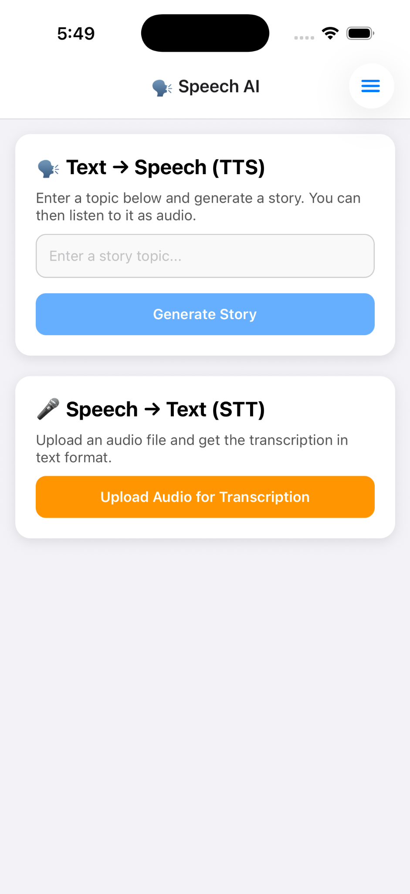
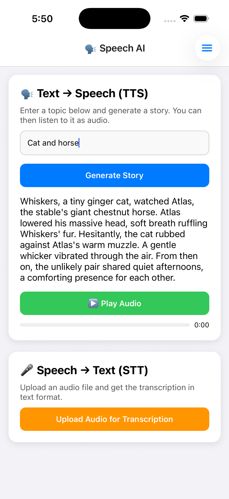
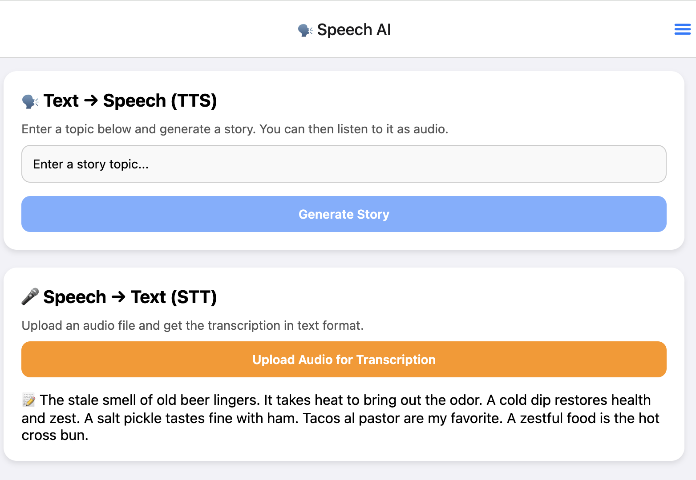
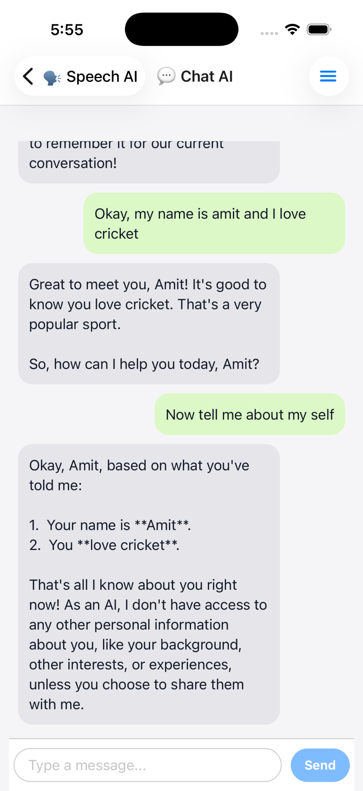

# AI Creativity Hub

### Agentic AI · RAG · Speech · Mobile-first Architecture

AI Creativity Hub is a **mobile-first, agentic AI system** designed to demonstrate how Large Language Models (LLMs) can be orchestrated into **interactive, narrative-driven user experiences**.

This repository is intentionally scoped to showcase **architecture, AI orchestration, and system design**, rather than production polish.

---

## 🎯 Problem This Project Solves

Most AI demos stop at **prompt → response**.

This project explores:

- How to build **agentic AI systems** with conversational memory
- How to combine **LLMs, memory, and speech** into real user workflows
- How AI can support **narrative-based and personalized experiences**, especially for education and storytelling

---

## 🧠 Key Capabilities

### 1️⃣ Conversational AI with Memory

- Remembers user-provided context (name, preferences)
- Demonstrates **short-term conversational memory**
- Enables more natural and personalized interactions

### 2️⃣ Text → Speech (TTS)

- User enters a topic
- LLM generates a short story
- Story is converted into audio
- Audio is played back inside the mobile app

### 3️⃣ Speech → Text (STT)

- User uploads audio
- Backend transcribes speech into text
- Can be reused for voice-driven AI workflows

### 4️⃣ Modular Agentic Design

- LLM orchestration
- Memory handling
- Speech services
- UI flows

All components are **loosely coupled** and easy to extend.

---

## 🧱 High-Level Architecture

```
React Native Mobile App
        ↓
Backend API Layer (Python / Flask)
        ↓
LLM Orchestration (Gemini)
        ↓
Memory Layer (conversation context)
        ↓
Speech Services (TTS / STT)
```

---

## 🛠️ Tech Stack

### Frontend

- React Native (Expo)
- TypeScript

### Backend

- Python 3.10+
- Flask
- Gemini LLM
- Pluggable memory strategy

---

## 📸 Demo Screenshots

> Images are placed inside the `/screenshots` folder and ordered to reflect the user journey.

### 01 — Text Input for Story Generation



### 02 — Story Generated with Audio Playback (TTS)



### 03 — Speech to Text (STT)



### 04 — Conversational AI with Memory



---

## 🧩 Why This Matters (Architect Perspective)

This project demonstrates:

- Moving from **LLM APIs** to **AI-powered systems**
- Designing **agent-like behavior** using memory and orchestration
- Integrating AI into **real product flows**
- Building **AI-native mobile experiences**

These patterns are directly applicable to:

- Educational AI platforms
- Narrative-driven learning
- Conversational assistants
- Agent-based systems

---

## 🚀 Future Extensions

- Long-term memory using vector databases
- RAG over domain-specific content
- Multi-agent workflows (planner / narrator / evaluator)
- Streaming responses for real-time UX
- Cloud deployment and scalability

---

## ⚠️ Notes

- This project is **not intended as a production-ready system**
- It is designed to demonstrate **architecture, AI workflows, and system thinking**
- Most production work I’ve done is under NDA; this repo recreates those patterns in a simplified, explainable form

---

## 📄 License

MIT License
